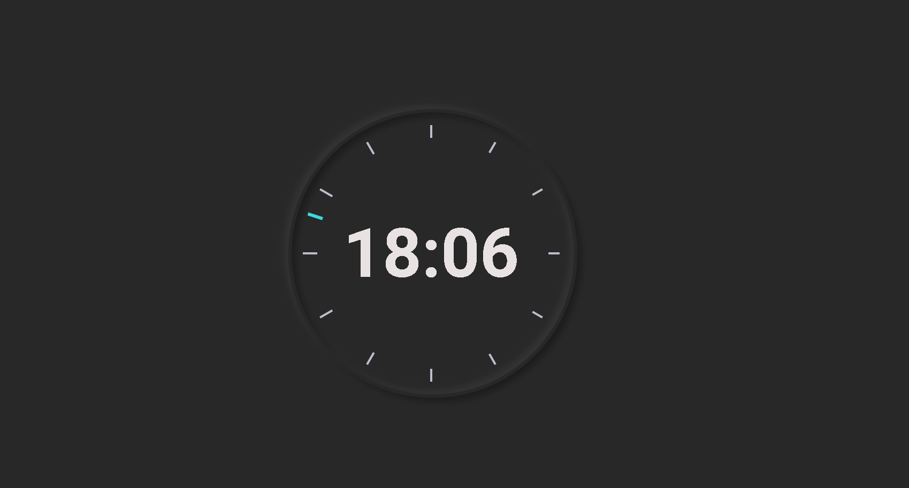

# Relógio Analógico

## Layout principal

 


# Tecnologias utilizadas
## Back end
- JavaScript
## Front end
- HTML / CSS 


# Como executar o projeto

```bash
# clonar repositório
# https://github.com/JGMeneses/Projeto-Relogio.git
# executar o o index.html utilizando a extensão GoLive

```


# Autor

João Victor Gomes Meses
